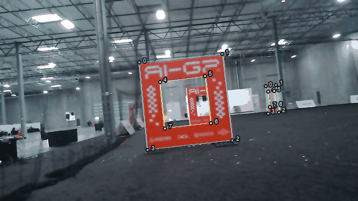
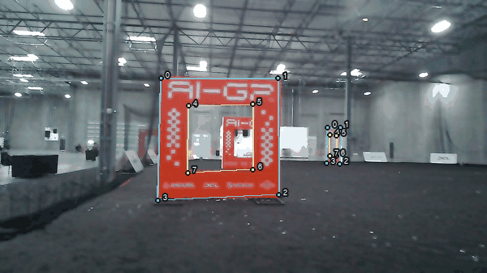
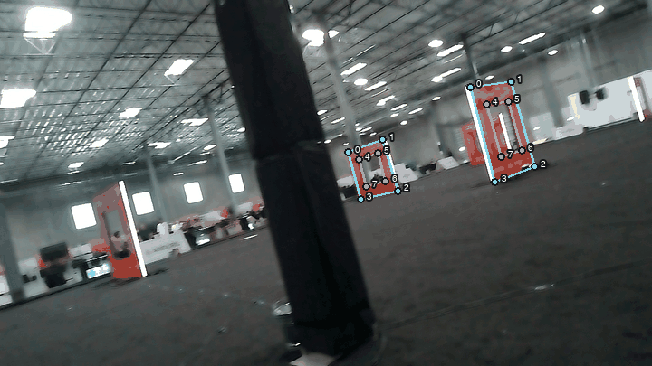
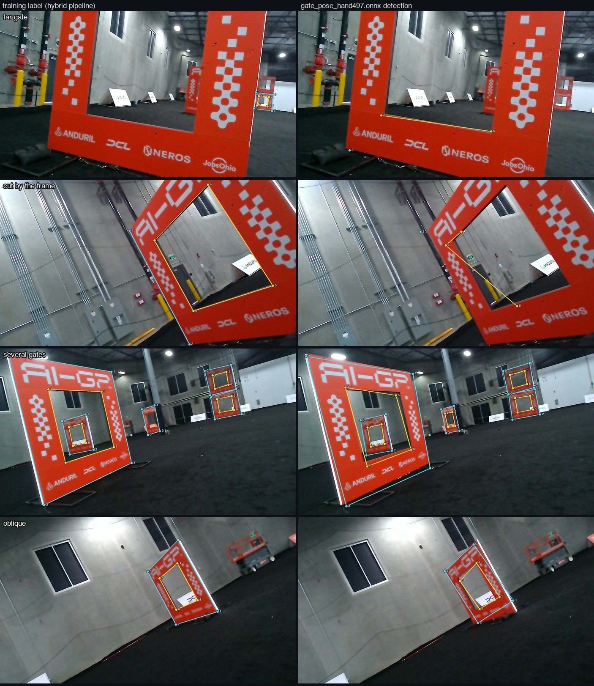

# aigp-perception

**Gate-corner perception for our AI Grand Prix entry** (Team Electric Fire): a geometric auto-labeller for the eight corners of the racing gate, a hybrid labeller that pairs it with a detector, the training and evaluation scripts behind the two shipped `yolov8n-pose` models, and an onnxruntime detector for the Jetson Orin. Nothing here is on the flight path; this repo's job is to hand the flight client a model and a measured number for how much to trust it.

The whole project is written up in [the paper](https://github.com/bojro/aigp-sim/blob/main/paper/paper.md) in the sibling `aigp-sim` repository; Section 4 is this repo.

*The camera circling one gate through the first hundred frames of the walk-around: the eight corners keep their ids as the view swings around the gate, which is what a pose solve needs.*

*The same model holding one gate at mid range while the camera sways: the corners stay on the gate, and the far gate behind it is picked up as well. Frames 29 to 79 of the first walk-around.*

*`gate_pose_hand497.onnx`, the model this repo ships, on forty raw frames from the aircraft's camera as it walks through the hall and closes on a gate, run through the same detector class the flight code uses. Cyan is the outer ring, yellow the opening, numbers are the corner ids; corners below the 0.25 keypoint threshold are left out, so what is drawn is what the aircraft would get.*

## Results

| | |
|---|---|
| Fine-tune on hybrid labels, held-out contiguous blocks | box mAP50-95 **0.283 → 0.636**, pose **0.760 → 0.854**, keypoint error vs geometry 11.8 → 8.3 px |
| Close-gate recall once human labels were used | **71.9% → 100%** (23/32 → 32/32) on 67 held-out frames; close gates are the ones flown through |
| The two shipped models at a real gate, 1345 frames | `hand497` over `hand434`: corner flicker **4.2% vs 6.0%**, usable fragments **37 vs 78**, longest unbroken run **178 vs 142** frames |
| Corner-visibility threshold | library default 0.5 left the policy able to act **36%** of the time; **0.25**, chosen at the gate, gives 59% |
| Latency on the Orin | **27.4 ms** per model at 640×360 on the GPU; one model fits the 33 ms budget, two do not |
| Labeller accuracy | **4.36 px** median against human labels. The 0.75 px it scored itself was measured against the model it solves for |

The last row matters most: every accuracy figure in this repo before the human labels arrived was self-scored, and every mAP before the contiguous-block split (0.517 random vs 0.283 blocks, same model) was optimistic. Both are recorded as such.

*Four difficult cases, each shown as the training label on the left and the shipped model's detection on the right. Row 1, far gates: the label pipeline traced one of the two; the model finds both. Row 2, a gate cut by the frame: six labelled corners, and the model places one edge of the opening. Row 3, five gates at once: both sides put eight ordered corners on each. Row 4, an oblique view: the planar rings still land. Where the two columns differ is where the detector adds to, or falls short of, the geometry it learned from.*

## Method

Fine-tuning a YOLO pose model is standard. Two parts of the pipeline are specific to this task:

* **Labelling by measurement rather than recognition.** A gate is an orange ring, so its colour mask has a hole; in the contour hierarchy the parent is the outer square and the child is the opening. Ring identity comes from topology, which sidesteps the problem that defeats vision-language models on this task: telling eight similar corners apart. From there it is line fitting, corner intersection (corners past the frame edge included), sub-pixel edge refinement and one homography over all eight points.
* **Detector proposes, geometry disposes.** The detector finds gates the geometry cannot trace; the geometry refines each proposal to the image's edges and applies its own per-corner checks. That doubled the yield at the same accuracy, and the detector's confidence could not have done it: recovered proposals scored 0.53, rejected ones 0.56.

## The gate

Square annulus, front face planar: outer boundary 2700 mm, flyable opening 1500 mm, concentric, 260 mm deep (spec 3.7). Eight keypoints, ids 0-3 outer ring and 4-7 inner ring, each clockwise from top-left as seen:

    0 ───────────── 1        out_UL out_UR out_BR out_BL   ids 0 1 2 3
    │  4 ───── 5  │         in_UL  in_UR  in_BR  in_BL    ids 4 5 6 7
    │  │       │  │
    │  7 ───── 6  │         flip_idx [1,0,3,2,5,4,7,6]  (fliplr swaps L/R)
    3 ───────────── 2        flipud 0                      (a vertical flip would
                                                           swap ring identity silently)

Same convention as the flight repo's `models/README.md` and our Roboflow exports, so labels interchange without translation.

## Further documentation

1. [`models/README.md`](models/README.md): the two shipped models, exactly how each was trained, and what is and is not established about them.
2. [`deploy/README.md`](deploy/README.md): which of the two deployment stacks actually ran on the aircraft, and the two fixes with a larger effect than the model choice.
3. [`research/README.md`](research/README.md): a table of every one-off experiment, the question it asked, the answer, and where that answer now lives in the engine.

## The pipeline, stage by stage

1. **Geometric labels** from a colour mask: `aigp-autolabel <frames> --out work/autolabel` (`aigp_perception/autolabel_gate_pose.py`). Frames it cannot trace go to review, about a third.
2. **Hybrid labels**: `aigp-hybrid-label <frames> --model best.pt --out work/hybrid` (`aigp_perception/yolo_assisted_label.py`). Roughly doubles yield.
3. **Human labels merged in**: `python datasets/merge_coco_splits.py <roboflow export> -o merged.coco.json` (Roboflow numbers ids from zero inside each split, so appending the lists silently mis-points annotations), then `AIGP_SPLIT=all AIGP_CAPTURE=<frames> AIGP_COCO=merged.coco.json AIGP_BUNDLE=bundle python datasets/build_ab_datasets.py` (hand labels replace ours wherever a human looked; contiguous held-out blocks).
4. **Train** on the pod: `AIGP_DATA=<bundle>/A_merged AIGP_TAG=... python train/train_final.py`; `train/train_ab.py` for the A/B that measured what the hand labels bought. Exact settings for both shipped models are in `models/README.md`.
5. **Judge** against humans and PnP, not mAP: `python eval/eval_gate_pnp.py --weights <best.pt> --images <val> --truth <labels> --hand-stems <stems.json>`. `eval/compare_models.py` runs two ONNX models side by side.
6. **Deploy**: `python deploy/onnx/verify.py --model models/gate_pose_hand497.onnx --frames <frames>` reports the execution provider, latency at 640×360 against a 33 ms budget, and how often a detection becomes a pose; non-zero exit if something would bite in flight. Flight thresholds: box confidence 0.4, keypoint confidence 0.25 (`deploy/onnx/gate_detector.py`).

## Limitations

* **Nothing here has flown.** `deploy/onnx/` has never run on the aircraft; `deploy/orin/` ran, on the torch stack from our flight client, with the camera at a bench and then at one gate.
* **All training data is a person walking around a gate**, at 2 fps, not a drone flying one. The only in-flight capture contained no gate.
* **`hand434` and `hand497` have no held-out number.** Both trained on every frame we had, by choice. Their training curves measure fit, not generalisation. The held-out result above is from a sibling checkpoint trained with a clean split.
* The PnP reprojection cap of 2 px in the flight repo rejects 74% of real solves; 8 px keeps them without adding jitter (`deploy/onnx/README.md`).
* Motion blur is not the weak point: recall holds at 97-100% out to ~215°/s of simulated yaw smear.

## Layout

    aigp_perception/     the engine: autolabeller, hybrid labeller, paths
    models/              gate_pose_hand497 (current) and hand434, .pt + .onnx, with the recipe
    datasets/            Roboflow merge, A/B dataset builder, label validator, renderer
    train/               the two training scripts (run on the pod)
    eval/                held-out evaluation vs humans and PnP, model A/B, galleries
    deploy/onnx/         the onnxruntime detector, PnP, dual detector, verify (never flown)
    deploy/orin/         torch harnesses that ran on the aircraft's computer
    research/            the one-off experiments behind every constant, with a table
    docs/                the images on this page, and the script that renders them from the capture, the labels and the model

`aigp_perception/paths.py` reads `AIGP_CAPTURE`, `AIGP_TEAMMATE_PT` and `AIGP_WORK`; the 1207-frame capture and `work/` are not in the repo. `eval/gallery.py` shells out to ImageMagick's `montage`. Install with `pip install -e .[detector,deploy]` for ultralytics/torch and onnxruntime/pillow respectively.

## Label-format pitfalls

**Off-frame keypoints.** A keypoint outside the frame normalises outside [0,1], and Ultralytics rejects the label as corrupt, silently discarding the *entire image*, not the one point. Write them `v=0`; their estimated positions stay in `report.csv` for PnP.

**`SOLVEPNP_IPPE_SQUARE` object-point order.** It expects a specific corner ordering and sign convention. Get it wrong and you get reprojection errors of 1e10 px rather than an error. The flight repo's `vision/yolo_pnp.py` does it right.

## The other two repositories

* [`bojro/aigp-sim`](https://github.com/bojro/aigp-sim): the simulator, the plant, the policies, and the paper.
* [`Code-Red-Cables/AI_GP`](https://github.com/Code-Red-Cables/AI_GP) (private): the flight client and the on-site work.

We are Team Electric Fire: Bojro Das, Geneustace Wicaksono, Etienne Sasenarine, John Apessos, Grant Lin, Rocky Shao.
